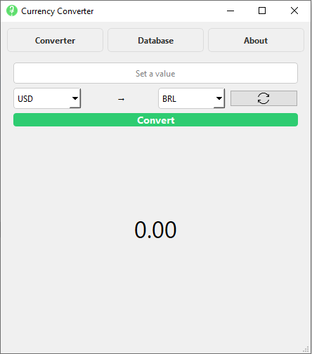
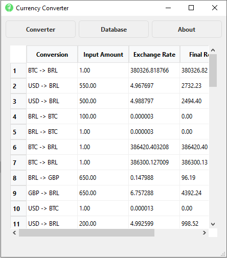
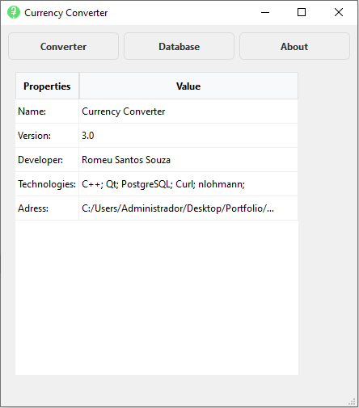

# Currency Converter — QT Graphical User Interface (v3.0)
A professional desktop application built with **C++** and **QT Framework** that provides real-time currency conversion, data persistence, and a sleek user interface.

## Features
- **UI/UX Polishing:** Dynamic page navigation using `QStackedWidget`. 🆕
    - Swap functionality to quickly invert currencies.
    - Responsive tables for conversion history.
- **Database integration:** Full history tracking using **PostgreSQL** and `libpqxx`.
- **Intelligent Caching:** Local data structure to minimize API calls and improve performance.
- **Secure Credential Handling**: Support for `.env` files to protect both API keys and database credentials.

## Used Technologies
- **Language:** C++.
- **Framework:** QT 6.x. 🆕
- **Database:** PostgreSQL.
- **APIs:** exchangerate.host (Real-time data)
- **Libraries:** libpqxx, libcurl.
- **Data parsing:** Nlohmann/json.
- **Tools:** Git, IcoConvert.

## Technical Observations
- The `Conversion` field in the History Table is a **derived field**, created by concatenating the base and target currencies (e.g., USD → BRL) to enhance UI readability. 🆕
- To ensure technical stability, the **Database Manager** utilizes a specific pointer-based connection lifecycle. This approach was implemented to prevent memory corruption and crashes between the `libpqxx` connector and the Qt Event Loop, resulting in a robust asynchronous-like data persistence. 🆕
- **Visual Fidelity (High DPI)**: Native support via Qt 6 ensures that fonts and custom icons remain sharp and clear on high-resolution displays (4K/Retina), regardless of Windows scaling settings. 🆕
- **Workflow-Centric UI**: The app features a constrained width (500px). This strategic UX choice allows it to sit side-by-side with other applications, eliminating the need for constant `Alt+Tab` during multitasking. 🆕

## Preview
| Converter Screen | History Screen | About Screen |
| :---: | :---: | :---: |
|  |  |  |

## Build and Setup

### Prerequisites
1. **Qt 6.x** Framework installed.
2. **PostgreSQL** server running and configured locally.
3. **C++ Package Manager** (such as **vcpkg**) to handle third-party dependencies.

### Dependencies
This project relies on the following packages. If you are using **vcpkg**, you can install them by running:
    ```bash
    vcpkg install libpqxx libcurl nlohmann-json

Note: Ensure your CMake toolchain is pointing to your vcpkg installation so the dependencies are discovered automatically during configuration.

### Configuration

1. In the project root, duplicate the template file:
    ```bash
    cp .env.example .env
2. Open the new .env file and populate it with your credentials:
    ```bash
    # API Configuration
    EXCHANGE_RATE_KEY=your_api_key_here

    # Database Configuration
    DB_HOST=localhost
    DB_PORT=5432
    DB_NAME=currency_converter
    DB_USER=postgres
    DB_PASS=your_password_here
3. Move or copy this finalized .env file into your active build directory (e.g., build-release/) so the executable can read it at runtime.